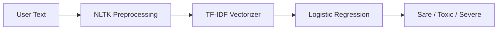

# CyberGuard — AI-Based Cyberbullying Detection System

[](https://www.python.org/)
[](https://streamlit.io/)
[](https://scikit-learn.org/)
[](LICENSE)

**CyberGuard** is an end-to-end **Natural Language Processing (NLP)** and **Machine Learning** system that classifies social media text into three safety categories. It includes a production-ready **Streamlit** web application for real-time analysis, batch CSV screening, and model performance dashboards.

> **Repository:** [github.com/asim548/CyberGuard-AI-Based-Cyberbullying-Detection-System](https://github.com/asim548/CyberGuard-AI-Based-Cyberbullying-Detection-System)

---

## Features

| Feature | Description |
|---------|-------------|
| **3-class classification** | Safe, Toxic, and Severe Bullying |
| **Real-time analysis** | Paste any tweet, comment, or message for instant prediction |
| **Batch processing** | Upload CSV files and export annotated results |
| **Interactive dashboard** | Plotly charts: confidence gauge, probability bars, confusion matrix |
| **NLP pipeline** | NLTK cleaning, lemmatization, stopword removal |
| **ML pipeline** | TF-IDF (1–2 grams) + balanced Logistic Regression |
| **Jupyter notebooks** | Full EDA, preprocessing, training, and evaluation workflow |
| **Kaggle integration** | One-command dataset download via `kagglehub` |

---

## Classification Categories

| Category | Description | Example signal |
|----------|-------------|----------------|
| **Safe** | Normal, non-harmful content | Friendly conversation |
| **Toxic** | Insults, harassment, mild bullying | Personal attacks |
| **Severe Bullying** | Threats, hate speech, severe abuse | Violence or self-harm language |

---

## Model Performance

Trained on **11,060** labeled tweets (Kaggle Cyberbullying Tweet Dataset):

| Metric | Test set |
|--------|----------|
| **Accuracy** | 72.5% |
| **F1 (macro)** | 67.5% |
| **Training samples** | 7,742 |

> Metrics are saved in `models/training_metrics.json` after training. Re-run `python -m src.train` to reproduce.

---

## Quick Start

### Prerequisites

- Python 3.10 or newer
- pip

### Installation

```bash
git clone https://github.com/asim548/CyberGuard-AI-Based-Cyberbullying-Detection-System.git
cd CyberGuard-AI-Based-Cyberbullying-Detection-System
pip install -r requirements.txt
```

### Run the web app (model included)

```bash
streamlit run app.py
```

Or on Windows, double-click `run_app.bat`.

Open **http://localhost:8501** in your browser.

### Train from scratch (optional)

```bash
# If dataset is missing, generate sample data or download from Kaggle
python scripts/generate_sample_data.py
# OR
python scripts/download_kaggle_dataset.py

python -m src.train
streamlit run app.py
```

---

## Web Application

The Streamlit app includes five sections:

1. **Dashboard** — System overview, pipeline explanation, recent analysis history  
2. **Analyze Text** — Single-message classification with sample presets  
3. **Batch Analysis** — CSV upload, pie-chart summary, downloadable results  
4. **Model Insights** — Per-class precision/recall/F1, confusion matrix heatmap  
5. **About Project** — Project overview, tech stack, development timeline  

---

## Tech Stack

| Layer | Technologies |
|-------|----------------|
| **Language** | Python 3.10+ |
| **NLP** | NLTK (tokenization, lemmatization, stopwords) |
| **ML** | scikit-learn (TF-IDF, Logistic Regression) |
| **Data** | Pandas, NumPy |
| **Visualization** | Plotly, Matplotlib, Seaborn |
| **UI** | Streamlit |
| **Notebooks** | Jupyter (see `requirements-notebooks.txt`) |
| **Dataset** | [Kaggle — Cyberbullying Tweets](https://www.kaggle.com/datasets/soorajtomar/cyberbullying-tweets) |

---

## Project Structure

```
CyberGuard/
├── app.py                      # Streamlit web application
├── config.py                   # Paths, labels, and app constants
├── requirements.txt            # Runtime dependencies
├── requirements-notebooks.txt  # Jupyter / EDA extras
├── run_app.bat                 # Windows launcher
├── data/
│   ├── cyberbullying_tweets.csv
│   └── sample_upload_template.csv
├── models/
│   ├── cyberguard_model.joblib # Trained pipeline (included)
│   └── training_metrics.json
├── notebooks/
│   ├── 01_data_preprocessing.ipynb
│   ├── 02_model_training.ipynb
│   └── 03_evaluation_and_demo.ipynb
├── scripts/
│   ├── download_kaggle_dataset.py
│   └── generate_sample_data.py
└── src/
    ├── preprocess.py           # NLTK text cleaning
    ├── train.py                # Training CLI
    ├── predict.py              # Inference API
    └── utils.py                # Dataset loading & label mapping
```

---

## How It Works



1. **Input** — Raw text from user or CSV  
2. **Preprocessing** — Lowercase, URL/mention removal, lemmatization  
3. **Vectorization** — TF-IDF with unigrams and bigrams (max 25k features)  
4. **Classification** — Balanced logistic regression with probability scores  

---

## Kaggle Dataset Download

```bash
python scripts/download_kaggle_dataset.py
python -m src.train
```

Requires [Kaggle API credentials](https://www.kaggle.com/docs/api) (`kaggle.json` in `~/.kaggle/`).

If `import kagglehub` fails:

```bash
pip install "kagglesdk==0.1.22" "kagglehub==1.0.1"
```

---

## Development Timeline

| Week | Task |
|------|------|
| 1 | Data preprocessing & EDA |
| 2 | Model training & evaluation |
| 3 | Streamlit web application |
| 4 | Testing, documentation & report |

---

## API Usage (Python)

```python
from src.predict import load_model_bundle, predict_text

bundle = load_model_bundle()
result = predict_text("You're so annoying, nobody likes you here.", bundle)
print(result["label"], result["confidence"])
# Toxic 0.87...
```

---

## Contributing

Contributions, issues, and feature requests are welcome. Please open an issue on GitHub before submitting large changes.

---

## License

This project is released under the [MIT License](LICENSE).

---

## Acknowledgments

- [Sooraj Tomar — Cyberbullying Tweets Dataset](https://www.kaggle.com/datasets/soorajtomar/cyberbullying-tweets) on Kaggle  
- NLTK and scikit-learn open-source communities  
- Streamlit for the interactive demo framework  

---

<p align="center">
  <strong>CyberGuard</strong> — Protecting online spaces with AI-powered text analysis.
</p>
